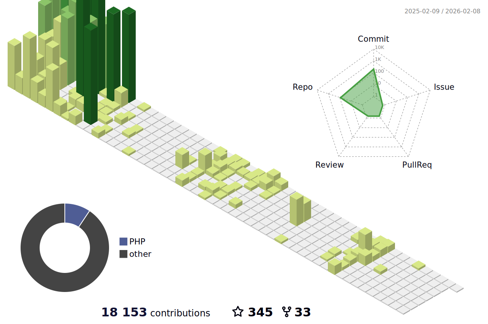

 
 

 
 

<!--color=00bfbf-->

  
   
  

 
 
 

  

<!-- replace x.x.x with actual version -->
<!-- -->

<codersrank-skills-chart username="bhza" labels legend tooltip ></codersrank-skills-chart>

### Main skills:
<!--&nbsp;-->
<!--&nbsp;-->
<!--&nbsp;-->
&nbsp;
&nbsp;
 
### Tools:
&nbsp;
&nbsp;
&nbsp;
&nbsp;
&nbsp;
&nbsp;
&nbsp;

### Other Knowledge:
<!--&nbsp; -->
<!--&nbsp;-->
<!--&nbsp;-->
&nbsp;
&nbsp;
<!--&nbsp;-->
  
### Studying in this moment:
&nbsp;
<!--&nbsp;-->
&nbsp;

 
  
 	
  
   
 

 
<b>Visitors Count</b>
  

 
 

 
   

  

<!---->

 
  

 
  

 
  
 
  
  <!---->
  
  

 

  
  ##
 

  <h1>### Hi there 👋</h1>       
- 🔭 I’m currently working on home office. 
- 📫 How to reach me:bruno.almeida81@fatec.sp.gov.br 

<!--
**bhza/bhza** is a ✨ _special_ ✨ repository because its `README.md` (this file) appears on your GitHub profile.

Here are some ideas to get you started:

- 🔭 I’m currently working on ...
- 🌱 I’m currently learning ...
- 👯 I’m looking to collaborate on ...
- 🤔 I’m looking for help with ...
- 💬 Ask me about ...
- 📫 How to reach me: ...
- 😄 Pronouns: ...
- ⚡ Fun fact: ...
-->

    

  
  

  
