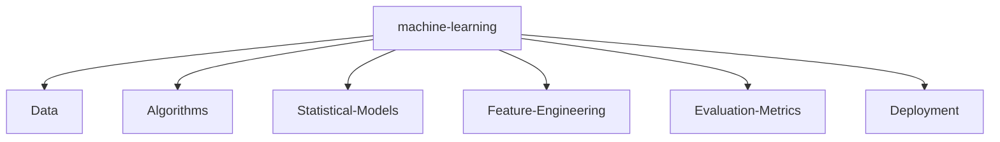

<br>
<br>


<br>
<br>

<!--   my-header-img -->

<!--<a href="https://www.python.org/"></a> -->

#  Hi, this is my github perfil be welcome.

<p>
    <a href="https://github.com/bhza/bhza"></a>
    <a href="https://github.com/bhza/bhza/graphs/contributors"></a>
    <a href="https://github.com/bhza/bhza/stargazers"></a>
    <a href="https://github.com/bhza/bhza/network/members"></a>
       
</p>

I am 🧙 Programmer and fullstack developer and 🏆 Open Source lover

Welcome to my page; on my Github, you can find:

- Projects created by me
- Projects contributed by me


<br>

## 📧 You can contact me on:

[](https://www.linkedin.com/in/bruno-henrique-a2a089252/)

_I am open to new opportunities/contributions._

<br>

## 🔎 You can find me on:

<a href="mailto:bruno.fateclins@gmail.com"></a>
[](https://x.com/)
[](https://www.linkedin.com/)
[](https://t.me/)
[](https://github.com/bhza/)

<br>

## 📈 Github stats:

<!--color=00bfbf-->

<!--<div align="center">  -->

<table>
  <tr>
    <td>
      
    </td>
    <td>
      
    </td>
  </tr>
</table>


---

[](https://github.com/anuraghazra/github-readme-stats)


---


 
 

---

## 🥇 Technology's


<!---->
<!---->
<!---->
<!---->


<!---->

<!---->


<!---->


<!---->

<!---->

<!---->
<!---->
<!---->
<!---->


### 🥈 Other stack 


<!--  -->
<!--  -->
<!--  -->

<!--  -->


<!--  -->

<!--  -->

<!--  -->

<!--  -->

### 🥉 Studying stack


---

[](https://git.io/streak-stats)

<!-- </div> -->

<br>
<br>

## ⭐ Highlights and proficiences

<br>

- ⭐ Graphic Design.
- ⭐ Software Development Manager.
- ⭐ Software Process Analyst.
- ⭐ Computer Systems Programmer.
- ⭐ Information Technology Consultant.
- ⭐ Web Developer.
- ⭐ SEO (Search Engine Optimization) Analyst and Content Manager.
- ⭐ Technologist in Internet Systems.
- ⭐ Develop information technology systems.  
- ⭐ Manage information technology environments.  
- ⭐ Provide technical support to clients/users.  
- ⭐ Prepare documentation for information technology systems.  
- ⭐ Establish standards for the information technology environment.  
- ⭐ Offer solutions for information technology environments.  
- ⭐ Research innovations in information technology and personal characteristics.  
- ⭐ Knowledge of website/web project standards.  
- ⭐ Knowledge in web content creation.  
- ⭐ Knowledge of algorithms and programming logic.  
- ⭐ Elementary mathematics.  
- ⭐ Reading and text production.  
- ⭐ Knowledge of networks and the internet.  
- ⭐ Knowledge of data structures.  
- ⭐ Manage servers, networks, and IT infrastructure environments, ensuring high availability and performance.  
- ⭐ Implement and manage information security policies, including access control, encryption, and cyber threat prevention.  
- ⭐ Configure and monitor firewalls, VPNs, and intrusion detection and prevention systems (IDS/IPS).  
- ⭐ Plan and execute backups and disaster recovery strategies to ensure business continuity.  
- ⭐ Manage operating systems such as Windows Server and Linux distributions, performing periodic maintenance and updates.  
- ⭐ Monitor networks and systems using tools such as Zabbix, Nagios, and Grafana to identify and resolve performance issues.  
- ⭐ Automate system administration tasks using scripts in PowerShell, Bash, and Python.  
- ⭐ Deploy and manage cloud computing services such as AWS, Azure, and Google Cloud.  
- ⭐ Ensure compliance with security standards and regulations such as LGPD, ISO 27001, and GDPR.  
- ⭐ Configure and administer web servers like Apache, Nginx, and IIS.  
- ⭐ Manage and configure SQL and NoSQL databases, ensuring security and performance.  
- ⭐ Implement virtualization and container solutions using technologies such as VMware, Hyper-V, Docker, and Kubernetes.  
- ⭐ Conduct security audits to identify vulnerabilities and recommend risk mitigation solutions.  
- ⭐ Act in security incident management, performing forensic analysis and responding to cybersecurity incidents.  
- ⭐ Provide advanced technical support to users and development teams, ensuring the efficient operation of systems.  
- ⭐ Knowledge of internet-related legislation.  

---

## Studying 🚀

<br>

- 📚 Analyze business processes and identify IT solutions related to websites and portals for the Internet (World Wide Web) or Intranet, in business activities, with a focus on e-commerce and electronic marketing.  
- 📚 Manage and coordinate the development of system projects, including those with database access.  
- 📚 Design information system projects for the Internet.  
- 📚 Coordinate software development teams.  
- 📚 Define requirements for the technical specification of projects and their development.  
- 📚 Develop and implement different types of computing applications.  
- 📚 Integrate media and apply graphic interface design to Internet websites.  
- 📚 Design databases and utilize Database Management Systems (DBMS).  
- 📚 Employ emerging technologies such as mobile computing, wireless networks, and distributed systems.  
- 📚 Evaluate, test, and document software, focusing on systems that use the Internet as a platform.  
- 📚 Apply system standardization techniques.  
- 📚 Manage human and technological resources.  
- 📚 Build Internet information systems by coding in commonly used programming languages for web applications.  
- 📚 Contribute to innovation and knowledge development in this field.  
- 📚 Create digital systems with accessibility.

  <br>


## 🏆 Thophys earned by me :

<br>

<a href="https://github.com/ryo-ma/github-profile-trophy"></a>

<br>

### 🏆 Others trophys :

<br><br>

<p align="center">
  
</p>

<br><br>

## ⭐ Github Stars

<br>


<br>

## 🐍 Classic Old Snake ( Make by me with blobs, dont jugde me)  :

<br>

 

<br>

 

<br>

 

<br>


## 👤 Profile Views

counting of visitors to this page in this section started from June 30, 2023

<br><br>


<br><br>

## 📈 3D Graph's Make By Hard Work

This graph shows my interactions from my github account. And why is it here? Here I can show in more detail and in 3d form to better visualize what has happened since I joined the platform.

<br>


<br><br>

<!-- replace x.x.x with actual version -->
<!-- <script src="https://unpkg.com/@codersrank/skills-chart@x.x.x/codersrank-skills-chart.min.js"></script>-->


<br>
<br>
<br>

# 🎉 🎉 About me, in more specific terms

<br>

If you don't have any questions about my projects or my working methods, you can find out more about me here. As there are links to my social networks, feel free to contact me.

<br>
<br>
<br>
<br>
<br>
<br>
<br>


<br>
<br>

--- 

<br>

## 👥 Visit counter by countries.

I found it interesting to know which people visit my profile, since it's a global platform I'd like to know. First, I thought it would be interesting to know where the viewers are coming from on the map, in case some people have difficulties with geography there is a flag counter, have fun.

<br>

<a href="https://info.flagcounter.com/Vsph"></a>

<br>


<a href="http://s01.flagcounter.com/more/ap7"></a>

<br>
<br>

<p align="center" > ⚠️ If you also want to search using the api feel free, it is functional and fully working. ⚠️</p>

<br>
<br>

```geojson
{
  "type": "FeatureCollection",
  "features": [
    {
      "type": "Feature",
      "id": 1,
      "properties": {
        "ID": 0
      },
      "geometry": {
        "type": "Polygon",
        "coordinates": [
          [
            [
              -49.7467491
              
            ],
            [
             
              -21.6732591
            ]
          ]
        ]
      }
    }
  ]
}
```

<br>
<br>

## ⚠️ Machine Learning

<br>

<p align="center"> I'm currently interested in machine learning, but I'm not a professional in the field. </p>

<br>



<br>
<br>
<br>
<br>

## 🎊 Some more history .. 

<br>

Some history about what I've been doing and have done since I joined the platform with some graphics and a few other things that may have gone unnoticed until now.

<br>

| Repository Activity Trends                                                                                                        | Collaborative Productivity - Last 28 days                                                                                                                 |
| --------------------------------------------------------------------------------------------------------------------------------- | --------------------------------------------------------------------------------------------------------------------------------------------------------- |
|  |  |

| Repository Performance Stats - Last 28 days                                                                                          | Active Contributors - Last 28 days                                                                                                                    |
| ------------------------------------------------------------------------------------------------------------------------------------ | ----------------------------------------------------------------------------------------------------------------------------------------------------- |
|  |  |

| Star Geographic Distribution                                                                                                                    | Star History                                                                                                                         |
| ----------------------------------------------------------------------------------------------------------------------------------------------- | ------------------------------------------------------------------------------------------------------------------------------------ |
|  |  |

| Company Affiliation                                                                                                                           | Lines of Code Changes                                                                                                                |
| --------------------------------------------------------------------------------------------------------------------------------------------- | ------------------------------------------------------------------------------------------------------------------------------------ |
|  |  |

| Pull Request Size                                                                                                                                   | Pull Request Lifecycle                                                                                                                             |
| --------------------------------------------------------------------------------------------------------------------------------------------------- | -------------------------------------------------------------------------------------------------------------------------------------------------- |
|  |  |

| Currently Working On - Last 28 days                                                                                                                     | Top Active Contributors - Last 28 Days                                                                                                    |
| ------------------------------------------------------------------------------------------------------------------------------------------------------- | ----------------------------------------------------------------------------------------------------------------------------------------- |
|  |  |

| Repository Annual Ranking                                                                                                                          |
| -------------------------------------------------------------------------------------------------------------------------------------------------- |
|  |

### Main skills:
<!--&nbsp;-->
<!--&nbsp;-->
<!--&nbsp;-->
&nbsp;
&nbsp;
 
### Tools:
&nbsp;
&nbsp;
&nbsp;
&nbsp;
&nbsp;
&nbsp;
&nbsp;

### Other Knowledge:
<!--&nbsp; -->
<!--&nbsp;-->
<!--&nbsp;-->
&nbsp;
&nbsp;
<!--&nbsp;-->
  
### Studying in this moment:
&nbsp;
<!--&nbsp;-->
&nbsp;

<div> 
  <a href="https://www.youtube.com/channel/UCHOtNnW5KY9fkbPJcXdUkLA" target="_blank"></a>
 	<a href="https://www.twitch.tv/bruunows" target="_blank"></a>
  <a href = "mailto:bruno.almeida81@fatec.sp.gov.br"></a>
  <a href="https://www.linkedin.com/in/bruno-henrique-a2a089252/" target="_blank"></a> 
 

<div align="center">
<br><p align="centre"><b>Visitors Count</b></p>  
<p align="center"></p> 
<br></div>

<br><p align="center">   </p>
  


<!---->

<div align="center"><br>
  

<hr><br>
  
</div>
<div style="display: inline_block"><br>
  <div align="center"><br>
  
  <!---->
  
  
</div>
 </div>
  
  ##
 <div align="center" fontsize="50px">
  <h1>### Hi there 👋</h1>      <br>
- 🔭 I’m currently working on home office.<br>
- 📫 How to reach me:bruno.almeida81@fatec.sp.gov.br<br>

<!--
**bhza/bhza** is a ✨ _special_ ✨ repository because its `README.md` (this file) appears on your GitHub profile.

Here are some ideas to get you started:

- 🔭 I’m currently working on ...
- 🌱 I’m currently learning ...
- 👯 I’m looking to collaborate on ...
- 🤔 I’m looking for help with ...
- 💬 Ask me about ...
- 📫 How to reach me: ...
- 😄 Pronouns: ...
- ⚡ Fun fact: ...
-->
</div>
<br><br><br><br>

  
  

  
