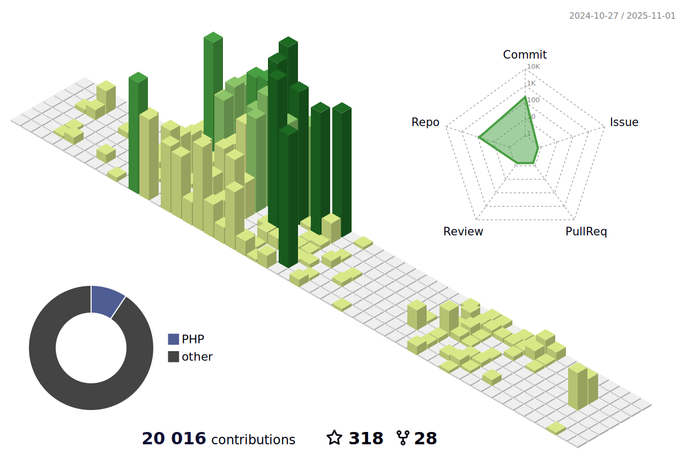

<br>
<br>


<br>
<br>

<!--   my-header-img -->

<!--<a href="https://www.python.org/"></a> -->

#  Hello, my name is Bruno .

<p>
    <a href="https://github.com/bhza/bhza"></a>
    <a href="https://github.com/bhza/bhza/graphs/contributors"></a>
    <a href="https://github.com/bhza/bhza/stargazers"></a>
    <a href="https://github.com/bhza/bhza/network/members"></a>
       
</p>

I am 🧙 Programmer and fullstack developer and 🏆 Open Source lover

Welcome to my page; on my Github, you can find:

- Projects created by me
- Projects contributed by me


<br>

## 📧 You can contact me on:

[](https://www.linkedin.com/in/bruno-henrique-a2a089252/)

_I am open to new opportunities/contributions._

<br>

## 🔎 You can find me on:

<a href="mailto:bruno.fateclins@gmail.com"></a>
[](https://x.com/)
[](https://www.linkedin.com/)
[](https://t.me/)
[](https://github.com/bhza/)

<br>

## 📈 Github stats:

<!--color=00bfbf-->

<!--<div align="center">  -->

<table>
  <tr>
    <td>
      
    </td>
    <td>
      
    </td>
  </tr>
</table>


---

[](https://github.com/anuraghazra/github-readme-stats)


---


 
 

---

[](https://git.io/streak-stats)

<!-- </div> -->

## 🏆 Thophys earned by me :

<br>

<a href="https://github.com/ryo-ma/github-profile-trophy"></a>

<br>

### 🏆 Others trophys :

<br><br>

<p align="center">
  
</p>

<br><br>

## ⭐ Github Stars

<br>


<br>

## 🐍 Classic Old Snake ( Make by me with blobs, dont jugde me)  :

<br>

 

<br>

 

<br>


## 👤 Profile Views

counting of visitors to this page in this section started from June 30, 2023

<br><br>


<br><br>




<!-- replace x.x.x with actual version -->
<!-- <script src="https://unpkg.com/@codersrank/skills-chart@x.x.x/codersrank-skills-chart.min.js"></script>-->


<a href="https://info.flagcounter.com/Vsph"></a>

<a href="http://s01.flagcounter.com/more/ap7"></a>

```geojson
{
  "type": "FeatureCollection",
  "features": [
    {
      "type": "Feature",
      "id": 1,
      "properties": {
        "ID": 0
      },
      "geometry": {
        "type": "Polygon",
        "coordinates": [
          [
            [
              -49.7467491
              
            ],
            [
             
              -21.6732591
            ]
          ]
        ]
      }
    }
  ]
}
```


| Repository Activity Trends                                                                                                        | Collaborative Productivity - Last 28 days                                                                                                                 |
| --------------------------------------------------------------------------------------------------------------------------------- | --------------------------------------------------------------------------------------------------------------------------------------------------------- |
|  |  |

| Repository Performance Stats - Last 28 days                                                                                          | Active Contributors - Last 28 days                                                                                                                    |
| ------------------------------------------------------------------------------------------------------------------------------------ | ----------------------------------------------------------------------------------------------------------------------------------------------------- |
|  |  |

| Star Geographic Distribution                                                                                                                    | Star History                                                                                                                         |
| ----------------------------------------------------------------------------------------------------------------------------------------------- | ------------------------------------------------------------------------------------------------------------------------------------ |
|  |  |

| Company Affiliation                                                                                                                           | Lines of Code Changes                                                                                                                |
| --------------------------------------------------------------------------------------------------------------------------------------------- | ------------------------------------------------------------------------------------------------------------------------------------ |
|  |  |

| Pull Request Size                                                                                                                                   | Pull Request Lifecycle                                                                                                                             |
| --------------------------------------------------------------------------------------------------------------------------------------------------- | -------------------------------------------------------------------------------------------------------------------------------------------------- |
|  |  |

| Currently Working On - Last 28 days                                                                                                                     | Top Active Contributors - Last 28 Days                                                                                                    |
| ------------------------------------------------------------------------------------------------------------------------------------------------------- | ----------------------------------------------------------------------------------------------------------------------------------------- |
|  |  |

| Repository Annual Ranking                                                                                                                          |
| -------------------------------------------------------------------------------------------------------------------------------------------------- |
|  |

### Main skills:
<!--&nbsp;-->
<!--&nbsp;-->
<!--&nbsp;-->
&nbsp;
&nbsp;
 
### Tools:
&nbsp;
&nbsp;
&nbsp;
&nbsp;
&nbsp;
&nbsp;
&nbsp;

### Other Knowledge:
<!--&nbsp; -->
<!--&nbsp;-->
<!--&nbsp;-->
&nbsp;
&nbsp;
<!--&nbsp;-->
  
### Studying in this moment:
&nbsp;
<!--&nbsp;-->
&nbsp;

<div> 
  <a href="https://www.youtube.com/channel/UCHOtNnW5KY9fkbPJcXdUkLA" target="_blank"></a>
 	<a href="https://www.twitch.tv/bruunows" target="_blank"></a>
  <a href = "mailto:bruno.almeida81@fatec.sp.gov.br"></a>
  <a href="https://www.linkedin.com/in/bruno-henrique-a2a089252/" target="_blank"></a> 
 

<div align="center">
<br><p align="centre"><b>Visitors Count</b></p>  
<p align="center"></p> 
<br></div>

<br><p align="center">   </p>
  


<!---->

<div align="center"><br>
  

<hr><br>
  
</div>
<div style="display: inline_block"><br>
  <div align="center"><br>
  
  <!---->
  
  
</div>
 </div>
  
  ##
 <div align="center" fontsize="50px">
  <h1>### Hi there 👋</h1>      <br>
- 🔭 I’m currently working on home office.<br>
- 📫 How to reach me:bruno.almeida81@fatec.sp.gov.br<br>

<!--
**bhza/bhza** is a ✨ _special_ ✨ repository because its `README.md` (this file) appears on your GitHub profile.

Here are some ideas to get you started:

- 🔭 I’m currently working on ...
- 🌱 I’m currently learning ...
- 👯 I’m looking to collaborate on ...
- 🤔 I’m looking for help with ...
- 💬 Ask me about ...
- 📫 How to reach me: ...
- 😄 Pronouns: ...
- ⚡ Fun fact: ...
-->
</div>
<br><br><br><br>

  
  

  
